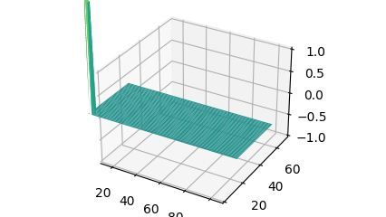

# ripple simulation, 2D, free-end refrections
The pulse in a rectangle reflects on the nearest wall and it'll be chopped after it reflects on the farthest wall.  
I simulated a pulse reflection in a rectangle with the Python program. You can't find the logic of pushing waves because it is a result of inertia and surface tension.  
I made a loop of adding averages (up, down, left, right, center) and inertia for every point of the surface. The average is the surface tension. If the left side is the wall, replace left to center like adding average(up, down, center, right, center) and inertia. The program has inertia at every point of the surface. When I added every point of the surface, replaced all inertia with the new value (current point value - previous point value).

# 長方形の中で反射する波。自由端反射のpythonプログラム

長方形の中で反射する波は、最初は近い壁での反射を繰り返すが、遠い壁で反射した波がかぶさってくると、細切れになっていく。  
これは自由端反射のpythonプログラムです。
プログラムは、波を移動させるように作っているのではありません。  
何をプログラムしてあるかというと、長方形を格子状に分割した全ての点に対し、慣性と表面張力の単純計算を繰り返すことだけを、プログラムしてあります。  
最近(2024年)知ったのですが、こういうやり方をセルオートマトンというようです。  
波に方向は与えていないが、波は右や左に進み、壁に当たってはね返ります。また左右からぶつかっても何事もなかったようにそれぞれの方向に進み続けます。  

このプログラムは、面上の全ての点に対し、次の単純計算を繰り返しています。
* ①盛り上がった1点は、表面張力により元に戻ろうとする。
* ②次のループでも表面張力により元に戻ろうとするが、前回の移動で慣性が生じており、前回と同じ量移動しようとする力も加わる。(両方加算する)
* ③以降、②の繰り返し。

理屈は落下するボールを描画するのと同じです。ボールも最初は引力で落ち始め、次は引力+前回移動量(引力✕1)、次は引力+前回移動量(引力✕2)と、速度は上がっていきます。  
水面の場合、水面を通り越してしまうと力のかかる方向が逆になるので、結果は行ったり来たりの動きになります。  
自由端反射は、左右の端を常に隣と同じ値にすることで実現しています。  
(固定端反射にしたい場合、左右の端を常に0とする)

## ソースリストの説明

updateが上記の単純計算です。for文で新しいzの値を計算します。ix,iyを中心とした5点の平均をとっているのが表面張力、これに前回値kを加算してz1に新しいzの値を作っていきます。上下左右の端は、隣の値をコピーします。これにより自由端反射となります。次に前回移動量kをz1-zとします。ここにあるifは、最初の波を穏やかにするために入れてあります。最後にz1をzに代入し、plot_surfaceで面を更新します。
以上。これだけです。

~~~ python
# free end refrections
# 自由端反射 2次元版

import numpy as np
import matplotlib.pyplot as plt
import matplotlib.animation as animation
#import matplotlib as mpl

X_SU = 120
Y_SU = 40

fig = plt.figure(figsize = (12.8, 7.2))
ax = fig.add_subplot(111, projection="3d")

plt.subplots_adjust(left=0, bottom=0, right=1, top=1)

x, y = np.meshgrid(range(0,X_SU),range(0,Y_SU))
z = 0.0 * x * y

z1 = z.copy()
k = z.copy()
z[2,2] = 30.0 # 左下端

def update(i):
    global z,z1,k
    print(i)
    z[0,:] = z[1,:]
    z[-1,:] = z[-2,:]
    z[:,0] = z[:,1]
    z[:,-1] = z[:,-2]
    for ix in range(1,X_SU-1):
        for iy in range(1,Y_SU-1):
            z1[iy,ix] = (np.sum(z[iy-1:iy+2,ix]) + z[iy,ix-1] + z[iy,ix+1])/5 + k[iy,ix]
    if i > 6:
        k = z1 - z
    z[1:-1,1:-1] = z1[1:-1,1:-1]
    ax.clear()
    vminmax = np.max(z)
    pl = ax.plot_surface(x, y, z, cmap = "viridis", vmin=-vminmax, vmax=vminmax)
    ax.set_zlim(-1,1)
    XYHAMI = int(X_SU*0.1)
    ax.set_xlim(XYHAMI,X_SU-XYHAMI)
    ax.set_ylim(0,X_SU-XYHAMI*4) #*0.8)

ani = animation.FuncAnimation(fig, update, interval=120, blit=False, save_count=720)
#ani.save("nami2d_freeend.mp4")
plt.show()
~~~
